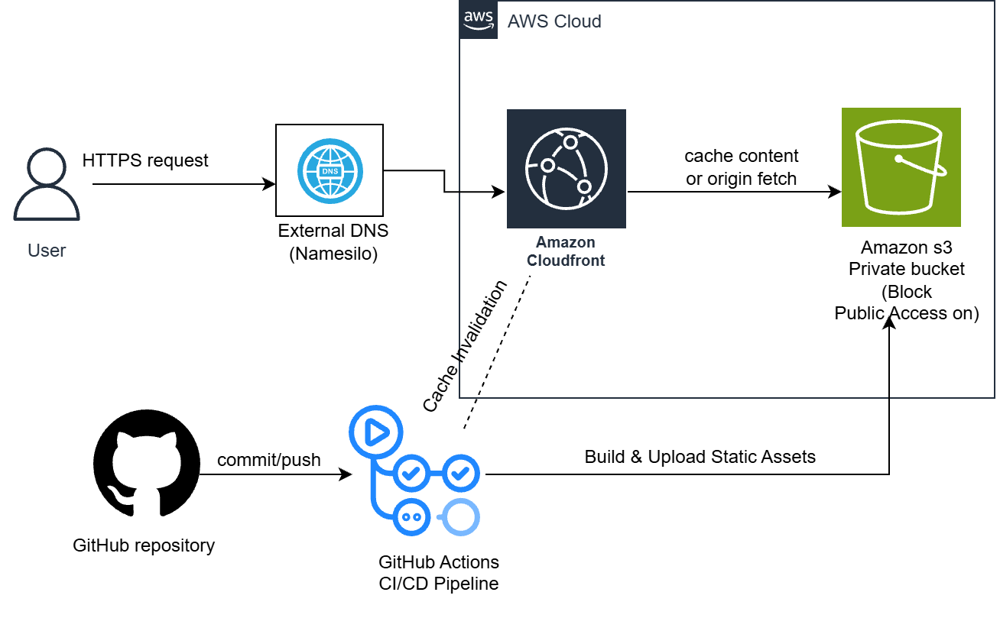

# Naomi Ansah – Cloud Portfolio

This repository contains the source code and infrastructure configuration for my personal cloud portfolio website.

The project was built to move beyond isolated AWS labs and demonstrate how a real-world static website can be securely deployed, automated, and operated in production.

## Live Website

https://naomiansah.blog

## Architecture Diagram



## Request Flow Overview

1. A user accesses the website via HTTPS using a custom domain.
2. DNS is managed by an external provider (NameSilo), which routes traffic to Amazon CloudFront.
3. CloudFront acts as the public entry point and terminates HTTPS using an ACM-managed SSL certificate.
4. If the requested content is cached at the edge, CloudFront serves it immediately.
5. On a cache miss, CloudFront securely fetches content from a **private Amazon S3 bucket** using Origin Access Control (OAC).
6. Static assets are built and deployed automatically via **GitHub Actions**, with cache invalidation ensuring users receive the latest version.

---

## Technologies Used

- React + Vite
- Amazon S3 (private bucket)
- Amazon CloudFront
- AWS Certificate Manager (ACM)
- GitHub Actions (CI/CD)
- External DNS (NameSilo)

---

## Repository Structure

```text
docs/        → Architecture diagrams and documentation
src/         → React application source code
public/      → Static assets
.github/     → CI/CD workflows
```
